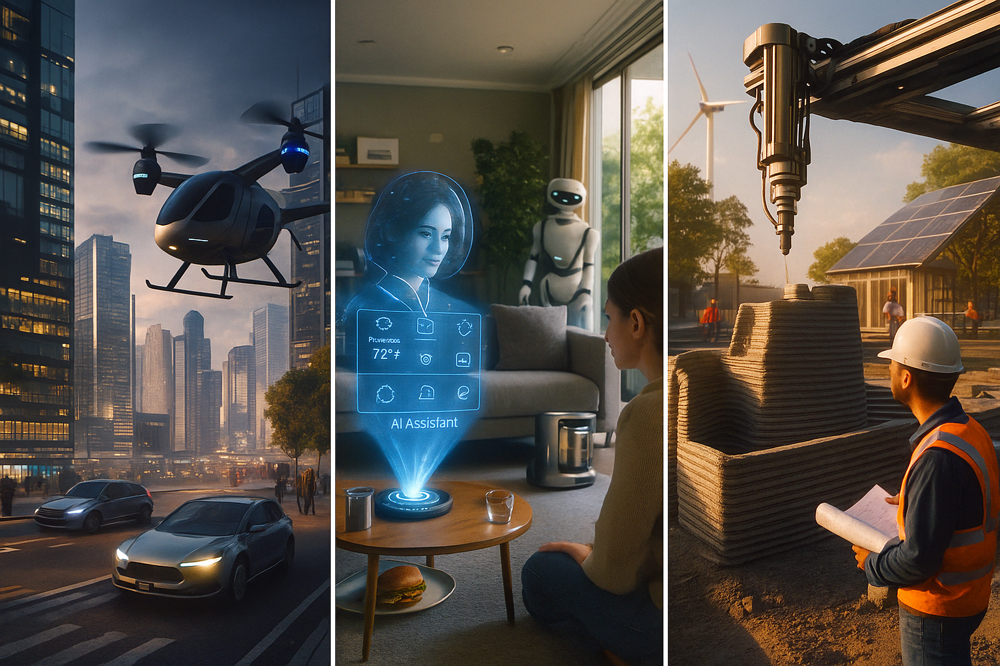

[](https://classroom.github.com/a/gSldEXG6)
# Welcome to Takoyaki팀

## 1️⃣ 팀원 소개

| **이름** | **전공** | **관심사** |
| --- | --- | --- |
| **류승목** | 전자시스템공학전공 | 인공지능, 3D Vision |
| **나현우** | 인공지능전공 | 인공지능, 프론트엔드, UX/UI |
| **장형진** | 인공지능전공 | 위스키, 백엔드, 스타트업 |
| **민은진** | 인공지능전공 | 인공지능, 웹 |
| **안성훈** | 인공지능전공 | 인공지능, 사물인터넷 |

### 팀 슬로건

if (GPT_RAM > Brain_RAM) {
    System.out.println("Study Harder!");
}

### 팀 소개

혁신은 멈추지 않는다.

***

## 2️⃣ 공통된 관심사 : AI

***

## 1주차 활동

- Team Mission 1 : 기술 정리
  - | 태양열 발전 | 스마트 키친 | 로봇 청소기       |
  - | 전기 자동차 | 자율주행    | 웹, SNS (소셜 네트워크) |
  - | 스마트폰    | 원격 학습   | 무빙워크         |

- Team Mission 1 : 느낀점
  - **민은진**: 미래라고만 생각했던 기술들이 실제 생활에 녹아든 점이 정말 신기하고, 세상이 빠르게 변하고 있음을 느낍니다. 특히 전기자동차는 실제로 도로에서 흔히 볼 수 있을 만큼 보급이 많이 되어 출퇴근길이나 여행 때 전기차의 조용함과 친환경성이 크게 체감됩니다. 충전소 인프라도 빠르게 늘고 있어 앞으로의 변화가 더 기대됩니다.
  - **류승목**: 이정문 화백의 만화는 당시의 기술과 상상력을 결합하여 미래를 예측하는 통찰력이 놀라웠습니다. 미래 예측은 단순히 황당한 상상이 아니라, 현재의 기술 발전 동향을 깊이 이해하는 데서 비롯될 수 있음을 보여주었습니다. 예술가의 상상력이 과학 기술의 미래를 시각화하고, 실제로 현실화되는 결과를 낳았다는 점에서 매우 인상 깊었습니다. 이러한 사례는 창의적 사고가 미래를 앞당기는 중요한 동력이 될 수 있음을 시사했습니다. 상상이 현실이 되는 과정에서 현재 기술을 탐구하는 자세가 중요하다는 것을 깨닫게 되었습니다.
  - **안성훈**: 현시점에서 봐도 신기한 기술들인데 이런 기술들을 1965년에 상상하여 그렸다는 점에서 신기하였다. 특히 원격 수업, 소형 TV 전화기는 많이 접하는 기술이라 더 와닿았던 거 같다. 앞으로 미래의 삶에 편리한 다양한 기술들이 나올 것이라고 생각한다.
  - **나현우**: 1965년에 상상으로 그려진 기술들이 오늘날 현실로 구현된 점은 매우 인상적이다. 원격 수업, 소형 TV 전화기, 전기자동차 등은 이제 일상에서 흔히 접할 수 있는 기술로 자리 잡으며, 예술가의 상상력이 단순한 환상이 아니라 미래를 내다본 통찰이었음을 보여준다. 이러한 사례는 창의적 사고가 과학 기술의 발전과 결합할 때, 실제로 세상의 변화를 앞당길 수 있음을 시사한다. <br> 앞으로도 다양한 미래 기술이 등장해 삶의 편리함을 더욱 높여줄 것으로 기대된다. 그러나 동시에 개인정보 보호, 일자리 구조 변화, 환경적 영향 등 새로운 과제가 뒤따를 수 있다는 점에서 우려도 존재한다. 따라서 미래 기술 발전은 단순한 편리성 추구를 넘어, 사회적 책임과 균형 속에서 이루어져야 할 것이다.
  -  **장형진**: 1965년에 상상했던 기술들이 오늘날 현실이 된 점이 정말 신기했습니다. 전기차, 원격 수업, 영상통화처럼 일상에서 흔히 접할 수 있는 기술들이 예술가의 상상에서 시작되었다는 사실이 인상 깊었고, 앞으로의 기술 발전도 기대되지만 동시에 사회적 책임도 중요하다고 느꼈습니다.

- Team Mission 2 : 기술 정리
  - 플로팅 디스플레이 (Floating Display)
	• 공중에 영상이나 이미지를 띄워 보여주는 기술이 실제로 개발되고 있습니다.
	• 광고, 전시, 공연 등에서 시연되고 있고 일부는 상용화 단계에 들어섰습니다.
	• 개인 맞춤형 정보 제공이 가능하며, 교육·엔터테인먼트·의료 분야에서도 활용 가능성이 확인되고 있습니다.
  - AR/VR 융합 디스플레이
	• 증강현실(AR)과 가상현실(VR) 기기를 통해 몰입형 경험을 제공하는 기술은 이미 상용화되었습니다.
	• 메타버스 플랫폼, VR 게임, AR 교육 프로그램 등으로 실제 사용되고 있습니다.
  - 개인화된 인터페이스
	• 사용자의 데이터와 상황에 맞추어 맞춤형 정보를 제공하는 디스플레이 기술이 실현되고 있습니다.
	• 스마트폰, 스마트글라스, 차량용 HUD(Head-Up Display) 등에서 확인할 수 있습니다.

- Team Mission 2 : 느낀점
  - **류승목**: 저는 세 영상을 보면서 디스플레이 기술이 단순히 화면을 보여주는 수준을 넘어서, 공간과 현실 속에서 새로운 경험을 만들어내는 도구로 발전하고 있다는 점이 인상 깊었습니다. 특히 플로팅 디스플레이처럼 실제 공간 위에 정보를 띄워서 보여주는 기술이 이미 실현되고 있다는 사실이 놀라웠습니다. 단순히 편리한 기능을 구현하는 것에서 그치지 않고, 사람들이 안심하고 쓸 수 있는 기술을 만들어야 한다는 책임감도 함께 느꼈습니다.
  - **민은진**: 미래 기술들이 우리의 생활 방식을 근본적으로 바꾸어 놓을 것이라는 점이 인상적이었다.특히 스마트 글래스나 AR 같은 기술은 현실과 가상을 자연스럽게 연결해 과거에는 상상만 하던 경험을 가능하게 할 것 같다. 음성인식과 영상 인식 기술이 인간과 기계 간의 경계를 허물며, 더욱 직관적이고 자연스러운 소통을 가능하게 만들어 준다.
이처럼 다양한 미래 기술들이 상호작용하며 만들어낼 융합 혁신이 우리의 일상생활을 어떤 모습으로 변화시킬지 매우 궁금하고 기대된다.
  - **안성훈**: 영상을 시청하면서 언제 어디서나 사용할 수 있는 디스플레이가 점점 다양한 형태로 생기고 있다고 생각했습니다. 뿐만 아니라 각각의 기계가 다양한 형태를 지니고 있는데, 그 특징을 살리고 휴대성까지 고려하여 제작된다는 점이 인상적이었습니다. 이런 점은 이용자에게 더 편리한 경험을 제공할 뿐만 아니라 기술이 생활 전반에 어떻게 스며들어가는지를 보여주는 사례라고 느꼈습니다.
  -  **나현우**: 영상을 통해 다양한 형태의 디스플레이가 일상 속에 깊이 스며들고 있음을 확인할 수 있었다. 각각의 기기는 휴대성과 고유한 특징을 살려 제작되어 사용자에게 더 편리한 경험을 제공하며, 기술이 생활 전반을 바꾸어 나가는 과정을 잘 보여준다. 특히 스마트 글래스나 AR과 같은 기술은 현실과 가상을 자연스럽게 연결해 과거에는 상상에 그쳤던 경험을 가능하게 하고, 음성·영상 인식과 결합해 인간과 기계 간의 경계를 허물며 더욱 직관적인 소통을 가능하게 한다. 또한 플로팅 디스플레이처럼 실제 공간 위에 정보를 띄워 보여주는 기술은 단순히 화면을 넘어서 새로운 경험을 제공하는 도구로 발전하고 있다는 점이 인상 깊었다. <br> 앞으로 이러한 기술들이 단순한 편리함을 넘어, 신뢰성과 안전성까지 담보해야 함은 물론이다. 특히 스마트 글래스를 적극적으로 활용하기 위해서는 다양한 하드웨어 간의 호환성을 높이는 노력이 필요하다. 이를 통해 각 기술이 독립적으로 발전하는 데 그치지 않고 서로 연결되고 융합되어, 더 큰 혁신과 변화를 만들어 낼 수 있을 것이다.
  -   **장형진**: 디스플레이 기술이 단순히 화면을 보여주는 단계를 넘어, 현실 공간과 가상을 자연스럽게 잇는 도구로 발전하고 있다는 점이 인상 깊었습니다. 플로팅 디스플레이처럼 실제 공간 위에 정보를 띄우는 기술은 새로운 경험을 가능하게 하고, 스마트 글래스나 AR·VR은 현실과 가상을 융합해 직관적이고 몰입감 있는 소통을 만들어 준다는 점이 놀라웠습니다. 또한 각 기기가 휴대성과 고유한 특징을 살려 생활 속에서 더 편리한 경험을 제공한다는 사실도 흥미로웠습니다. 앞으로 이러한 기술들이 단순한 편리함을 넘어, 안전성과 신뢰성을 담보하며 서로 연결되고 융합될 때 더 큰 혁신을 가져올 것이라 기대됩니다.

## 2주차 활동
  - **MIT Sixth Sense** 연구활동
	- **Why?** <br> 현실 세계와 디지털 세계를 자연스럽게 연결하여, 사람이 기계에 적응하는 것이 아니라 기술이 사람의 생활 속에 스며들도록 하기 위함.
    - **What?** <br> 프로젝터와 카메라가 포함된 착용형 장치를 통해 손동작과 사물을 인식하고, 현실 위에 디지털 정보를 덧씌우는 상호작용 인터페이스.
    - **How?** <br> 카메라로 손과 객체를 추적하고, 프로젝터로 벽·책·손바닥 같은 실제 표면에 정보를 실시간으로 투영하여 직관적인 제스처 기반 조작을 가능하게 함.

  - **As-Is Vs To-Be**
    - 키보드 → 손가락 제스처나 가상 키보드(공중 타이핑, 터치 없는 입력)로 대체
    - 마우스 → 손동작, 손가락 모션, 카메라 기반 제스처 인식으로 대체
    - 모니터 → 프로젝터를 이용해 벽, 책상, 손바닥 등에 직접 투영하거나 AR 글래스를 통해 시각화

  - **15년 전 MIT Sixth Sense 기술과 현재**
    - **장형진**
	  - 약 15년 전 발표된 Sixth Sense 프로젝트는 저렴한 부품(약 300달러), 오픈소스 소프트웨어로 누구나 손쉽게 만들 수 있는 기술을 지향했습니다
      - 현재는 증강현실(AR) 가상현실(VR), 스마트폰, 웨어러블 기기(예: 스마트 글래스, AI 기반 핸드트래킹, 카메라, 센서 등)가 도입되면 서 훨씬 세련되고 대중화된 방식으로 발전했으며, 많은 일상 영역에서 활용될 수 있게 되었습니다
    - **안성훈**
      - 스마트폰 + AR 앱으로 현실 사물 위에 정보 띄우기
      - 구글 글래스, 마이크로소프트 홀로렌즈 등 착용형 디스플레이 (AR / MR)
      - 제스처 인식 기술 (카메라/센서 기반) 발전
      - 사물 인터넷(IoT) + 이미지 인식 기술이 더 좋아짐 → 사물 기반 정보 연동 가능
      - 과거에는 프로토타입이 무겁고 배터리, 처리 속도 등이 제한적이었지만, 현재는 초경량화, 고속 처리, 저전력 센서 기술 등이 발전
    - **민은진**
      - 현대 AR 스마트글래스, 핸드트래킹 기술, 웨어러블 디바이스(스마트워치, 삼성 갤럭시 링 등)로 이어졌습니다.
      - 물리 키보드/모니터 없이 제스처로 스마트폰, PC, IoT 기기를 컨트롤하는 기술이 실제 제품(구글 글래스, 삼성 웨어러블 등)에 적용되고 있습니다.
      - MIT에서 제안했던 기술이 현재에는 더 작고, 더 정교하게 진화해서 일상에 도입되고 있습니다.
    - **류승목**
      - 스마트폰 AR 기능, 제스처 인식, 웨어러블 기기(스마트워치, 스마트글래스), AR/VR 장비 등으로 발전·실현됨
      - 레이더 센서 기반 손동작 인식 (예: 구글 Pixel의 Soli 프로젝트)
      - 카메라·센서 기반의 모션 캡처 (예: AI 카메라가 손동작을 인식하여 스마트 TV 조작)
      - 메타 퀘스트, 애플 비전 프로 → 몰입형 가상/증강현실 경험 제공
      - Microsoft HoloLens, Google Glass → 실제 시야 위에 디지털 정보 표시
    - **나현우**
      - Google Glass <br> 착용형 스마트 글래스 <br> 시야 위에 정보를 직접 투사 <br> 음성 명령과 카메라 기능을 결합하여 직관적 사용 가능
      - Microsoft HoloLens <br> 혼합현실(MR) 헤드셋 <br> 홀로그램을 실제 공간에 띄우고, 손 제스처로 직접 상호작용 가능 <br> 확대, 이동, 회전 같은 직관적 동작을 지원
      - 레이더 기반 손동작 인식 (Soli 프로젝트) <br> 초소형 레이더 센서로 손가락·손바닥의 미세 움직임을 인식 <br> 물리적 접촉 없이 스마트폰이나 기기를 제어 가능
      - 스마트폰 AR 앱 + IoT 연동 <br> 카메라와 센서를 통해 사물을 인식하고 관련 정보를 화면에 덧씌움 <br> 예: 냉장고 속 재료 인식 후 유통기한 알림, 건물 인식 후 역사 정보 표시 <br> 다양한 일상 영역에서 현실과 디지털을 연결하는 방식으로 활용

## 3주차 활동
  - IMAGE
    


## 3️⃣ 한학기 동안의 활동 내역 

- 기관/부서 인터뷰 ✔️  

- 현장 탐방 ✔️  

- 멘토링 ✔️  
  - 내 지도 교수 함게 만나기
  - 대학원 방문 및 선배 만나기

- 프로젝트 진행 ✔️  
  - 과거에 사람들이 상상한 미래
  - 그들이 만들어가는 세상
  - 우리가 상상한 미래
  - 우리가 그리는 미래 그리고 나

- 각오와 소감 나누기 ✔️  


<!-- 활동 사진 추가 예시 -->


***

## 4️⃣ 인상 깊은 활동

- 활동명 – 활동에 대한 간단한 설명과 배운 점을 작성  
- 예: 멘토링에서 실리콘밸리 현업 경험을 들을 수 있어 진로 방향 설정에 큰 도움이 되었다.  

***

## 5️⃣ 특별히 알아보고 싶은 것
- 예: 현장실습 제도
- 예: TOPCIT 정기평가
- 예: 졸업 후 진로(대학원/취업)

***

## 6️⃣ 활동을 마친 소감

🔗학번 이름  
> "소감 내용을 여기에 작성합니다."

🔗학번 이름  
> "소감 내용을 여기에 작성합니다."

🔗학번 이름  
> "소감 내용을 여기에 작성합니다."

🔗학번 이름  
> "소감 내용을 여기에 작성합니다."

🔗학번 이름  
> "소감 내용을 여기에 작성합니다."


## Markdown을 사용하여 내용꾸미기를 익히세요.

Markdown은 작문을 스타일링하기위한 가볍고 사용하기 쉬운 구문입니다. 여기에는 다음을위한 규칙이 포함됩니다.

```markdown
Syntax highlighted code block

# Header 1
## Header 2
### Header 3

- Bulleted
- List

1. Numbered
2. List

**Bold** and _Italic_ and `Code` text

[Link](url) and 
```

자세한 내용은 [GitHub Flavored Markdown](https://guides.github.com/features/mastering-markdown/).

### Support or Contact

readme 파일 생성에 추가적인 도움이 필요하면 [도움말](https://help.github.com/articles/about-readmes/) 이나 [contact support](https://github.com/contact) 을 이용하세요.

